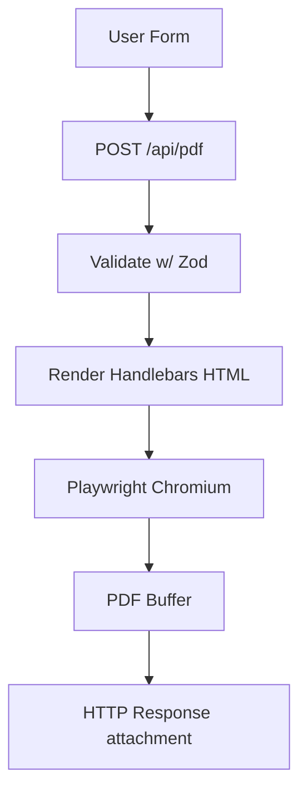

# High-Level Flow

Frontend form → POST /api/pdf?template=... → validate payload → compile Handlebars HTML → Playwright render → PDF stream response → browser download.

## Modules

- `routes/resume.js` → Express route handler
- `services/pdfService.js` → Playwright/Chromium wrapper
- `templates/` → Handlebars templates + shared partials
- `lib/validation.js` → Zod schema
- `lib/fonts.js` → font helpers (optional, for self-hosting URLs)
- `lib/logger.js` → pino logger

## Non-Goals (MVP)

No persistence; no email sending; no queues. (Add later.)

## Performance Notes

- Launch Chromium per request for simplicity; optimize later with a shared browser instance/pool.
- Set a hard timeout (e.g., 10s) on PDF generation.
- Limit HTML size (guard against abuse).