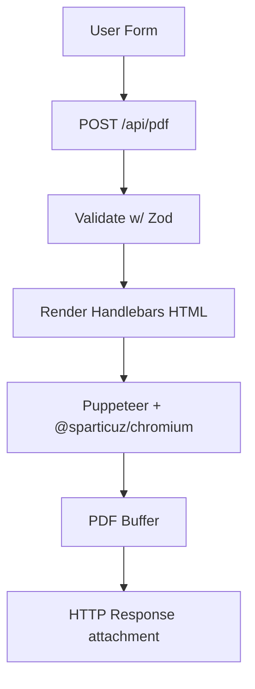

# High-Level Flow

Frontend form → POST /api/pdf?template=... → validate payload → compile Handlebars HTML → Puppeteer/Chromium render → PDF stream response → browser download.

## Modules

- `apps/web/app/api/pdf/route.ts` → Next.js (app router) API route
- `apps/web/resume/server/compile.ts` → Handlebars compiler w/ partial registration
- `apps/web/resume/server/pdf-service.ts` → Puppeteer wrapper & Chromium lifecycle
- `apps/web/resume/server/validation.ts` → Zod schema (shared w/ frontend types)
- `apps/web/resume/server/logger.ts` → pino logger
- `apps/web/resume/templates/` → Handlebars templates + shared partials
- `apps/web/lib/resume/download-pdf.ts` → browser helper to fetch + download PDFs
- `apps/web/components/resume/ResumeBuilderSection.tsx` → client UI with local persistence (embedded on /jobs)
- `apps/web/app/jobs/page.tsx` → renders chart + resume builder section

## Dependencies

- `puppeteer-core` (^23.7.1) → Lightweight Puppeteer without bundled Chromium
- `@sparticuz/chromium` (^141.0.0) → Serverless-optimized Chromium binary

## Non-Goals (MVP)

No persistence; no email sending; no queues. (Add later.)

## Performance Notes

### Serverless Environment (Vercel)

- **Cold start** (~3-5s): Chromium binaries extracted to `/tmp`, browser launched
- **Warm start** (~1-2s): Reuses `/tmp/chromium` from previous request
- **Browser reuse**: Single browser instance per Lambda container (see `globalThis.__RESUME_BROWSER__`)
- **Container lifecycle**: ~15 minutes of warmth after last request
- **Timeout**: 10s max (sufficient for cold starts)
- **Memory**: ~400-600MB used by Chromium + PDF generation

### Security & Limits

- Hard 10s timeout on PDF generation
- Input validation via Zod schema
- No persistent storage (PDFs streamed directly to client)
- Rate limiting handled by Vercel's edge network
