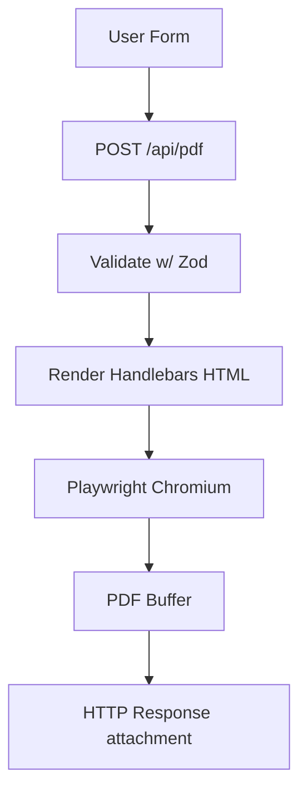

# High-Level Flow

Frontend form → POST /api/pdf?template=... → validate payload → compile Handlebars HTML → Playwright render → PDF stream response → browser download.

## Modules

- `apps/web/app/api/pdf/route.ts` → Next.js (app router) API route
- `apps/web/resume/server/compile.ts` → Handlebars compiler w/ partial registration
- `apps/web/resume/server/pdf-service.ts` → Playwright wrapper & Chromium lifecycle
- `apps/web/resume/server/validation.ts` → Zod schema (shared w/ frontend types)
- `apps/web/resume/server/logger.ts` → pino logger
- `apps/web/resume/templates/` → Handlebars templates + shared partials
- `apps/web/lib/resume/download-pdf.ts` → browser helper to fetch + download PDFs
- `apps/web/components/resume/ResumeBuilderSection.tsx` → client UI with local persistence (embedded on /jobs)
- `apps/web/app/jobs/page.tsx` → renders chart + resume builder section

## Non-Goals (MVP)

No persistence; no email sending; no queues. (Add later.)

## Performance Notes

- Playwright chromium launches once and reuses a single browser per process (see `globalThis.__RESUME_BROWSER__`).
- Set a hard timeout (e.g., 10s) on PDF generation.
- Limit HTML size (guard against abuse).
